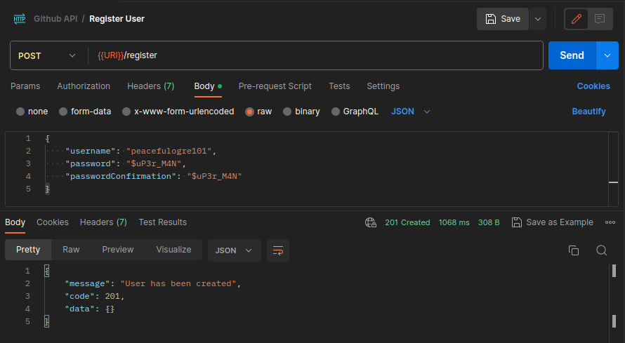

# Github API
This API acts like a proxy for the real Github API which allows the registered user to request for Github user's details.

## How to use the API

**URI:** https://f9q8dpz4ah.execute-api.us-east-1.amazonaws.com/

[](https://app.getpostman.com/run-collection/10019143-4908692e-cc3f-481d-913a-9bd6919598cd?action=collection%2Ffork&source=rip_markdown&collection-url=entityId%3D10019143-4908692e-cc3f-481d-913a-9bd6919598cd%26entityType%3Dcollection%26workspaceId%3Dae7aea33-9cc2-4dcf-8305-598bb3e5436a)

```
In order to run the API, we have to use Postman. 
Click the button above to redirect to the API collection.
Make sure you already have an account in Postman, otherwise, create one.
```

### Step 1: Fork the API Collection
After clicking the button above, you may see the screenshot below. You should click the **Fork Collection** button to save a copy in your account.


Input the **Fork label** name and select the Workspace to where the collection should be stored. Then, click **Fork Collection** button.


After forking, you should see the **Github API** collection at the left-side panel


### Step 2: Register a user
Select the **Register User** request, and click the **Body**.
The initial data is a JSON with empty value for each property, namely ```username```, ```password```, and ```passwordConfirmation```


Input a data in ```username```, ```password```, and ```passwordConfirmation```. Then, click **Send**. 

**Note:** Make sure ```password``` and ```passwordConfirmation``` are the same. Otherwise, it will return an error.



### Step 3: Login a registered user
Select the **Login User** request, and click the **Body**.
The initial data is a JSON with empty value for each property, namely ```username``` and ```password```


Input a data in ```username``` and ```password```. Then, click **Send**. Copy the token returned by the API, it will be used for requesting for github users' details.

**Note:** It will return ```401``` or ```Unauthorized``` if incorrect


### Step 4: Get Github Users' Details
Select the **Get Github Users** request, and click the **Authorization**.
On the left-side of the request, select **Bearer Token** for the authorization type. Then, paste the token you got from **Step 3** in the **Token** textbox.


After setting the authorization token, click the **Body**.
The initial data is a JSON with ```usernames``` property containing two (2) github usernames as array elements. You can add more github usernames if you want. After that, click **Send**, and it will return the ```name```, ```login```, ```company```, ```public_repos```, ```followers```, and ```averageFollowers``` of each github user.

**Note:** The API can only accommodate 10 usernames.


### Hooray! That's it for the Github API

<hr/>

## CloudWatch Sample Logs


<hr/>

## Hamming Distance

The script name is ```hammingDistance.js``` which is also included in the repository.
Run it like below:

```sh
$ node hammingDistance.js 4 2
$ Output: 2
```
<hr/>

### Technology used for API:
- Node.js
- Redis
- MySQL
- Express JS

### Infrastructure
- Elastic Container Service
- API Gateway
- Amazon RDS
- Amazon CloudWatch
- Docker
